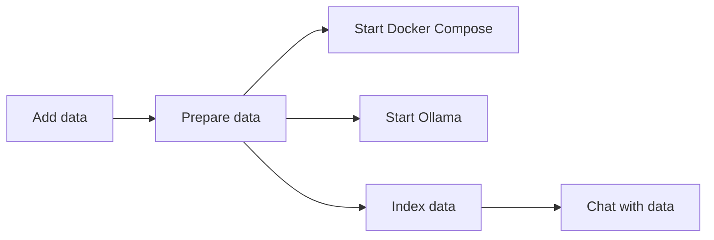
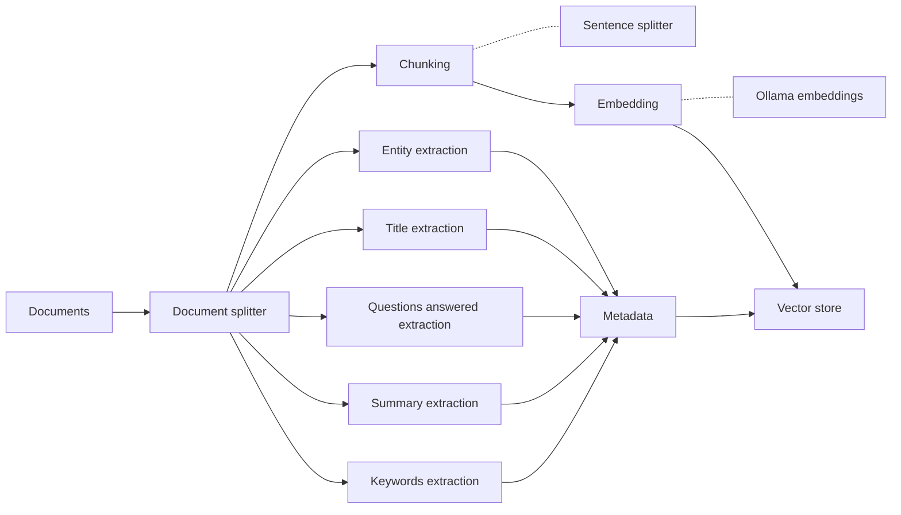
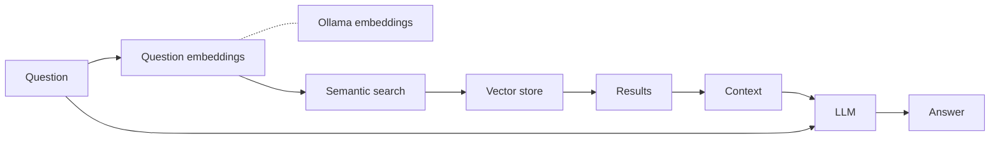

# iReal - Backend

This backeng is a RAG system to answer questions about school records.

The RAG is built using [LLamaIndex](https://www.llamaindex.ai),
[Ollama](https://ollama.com) to run a local LLM, and the
[Qdrant](https://qdrant.tech/) vector store.

## Getting started

### Dependencies

- [Docker](https://www.docker.com), [Docker Compose](https://docs.docker.com/compose/)
- [Ollama](https://ollama.com)
- [Pandoc](https://pandoc.org) and a flavour of [TeX](https://www.tug.org/), to
  convert the school records from `doc` to `markdown`
- [Poetry](https://python-poetry.org/)

### Setup

1. Clone the repository
1. Set up the environment with `poetry`

    ```sh
    poetry install
    poetry shell
    ```

1. Add the initial data in `data/0_raw/records`
   - [Aboriginal School Files](<https://emckclac.sharepoint.com/:f:/r/sites/AHkdl/Shared%20Documents/iREAL%20(AI%20and%20Indigenous%20Heritage)/EXTERNAL/Materials%20from%20partners/Datasets/Aboriginal%20School%20Files%20-%20%5Bnot%20to%20be%20shared%5D?csf=1&web=1&e=GK55QJ>)
1. Prepare the data

    ```sh
    poetry run prepare
    ```

1. Start the Docker stack with

    ```sh
    docker compose up --build
    ```

1. Start Ollama

    ```sh
    ollama start
    ```

1. Configure the project parameters. Rename `.env.example` to `.env` and adjust the values as needed
1. Run the cli tool to create an index, chat or export data from the index. Use the `-h` flag to see the available options

    ```sh
    poetry run cli -h
    ```

## System architecture

### Overview



### Indexing



### Querying



## Sample queries

Sample queries can be found in [Sharepoint](<https://emckclac.sharepoint.com/:w:/r/sites/AHkdl/Shared%20Documents/iREAL%20(AI%20and%20Indigenous%20Heritage)/EXTERNAL/Materials%20from%20partners/AWB%20Dataset%20Queries.docx?d=weac8d67e057a44aeb64645f2fed08265&csf=1&web=1&e=94Xj8O>)

## Resources

### Tutorials

- [RAG with llamaIndex and Elasticsearch](https://www.elastic.co/search-labs/blog/rag-with-llamaIndex-and-elasticsearch)
- [RAG using LLama 3.1 by Meta AI](https://lightning.ai/lightning-ai/studios/rag-using-llama-3-1-by-meta-ai)
- [How to run Ollama locally on GPU with Docker](https://medium.com/@srpillai/how-to-run-ollama-locally-on-gpu-with-docker-a1ebabe451e0)

### Chunking

- [Chunking for RAG: Best Practices](https://unstructured.io/blog/chunking-for-rag-best-practices)
- [Understanding Embeddings in RAG and How to use them - Llama-Index](https://www.youtube.com/watch?v=v6g8eo86T8A)
- [How to Set the Chunk Size in Document Splitter | RAG | LangChain](https://www.youtube.com/watch?v=1bbDH3kyf9I)

### Models

- [Mistral](https://ollama.com/libray/mistral)
- [Llama 3](https://ollama.com/library/llama3)
- [SpanMarker for Multilingual Named Entity Recognition](https://huggingface.co/tomaarsen/span-marker-mbert-base-multinerd)
- [NuExtract](https://huggingface.co/numind/NuExtract)

### Observability

- [Langfuse](https://langfuse.com)
- [LlamaIndex Langfuse Callback Handler](https://docs.llamaindex.ai/en/stable/examples/observability/LangfuseCallbackHandler/)

## Notes

- Using `IngestionPipeline` to ingest the documents into the vector store is
  faster than using the `VectorStoreIndex` class
- [Multi-step queries](https://docs.llamaindex.ai/en/stable/understanding/putting_it_all_together/q_and_a/#multi-step-queries)
  can help break down complex queries into an initial subquestion, and
  sequential subqueries until a final answer is returned. This is more expensive
  to run.
- Had issues with `elasticsearch` both with the index creation and querying. The
  indexing was quite alot slower and the querying was always returning a score
  of `1` even when the query was not a match.
- _Semantic drift_/_retrieval degradation_ seems to happen with this dataset the
  more the number of documents increase. This could be due to the fact that the
  document chunks are not suitable for indexing, or that they might be too
  similar to each other.
  - The [`RetryQueryEngine`](https://docs.llamaindex.ai/en/stable/examples/evaluation/RetryQuery/#retry-query-engine) is used to retry the query if the response is not satisfactory.
