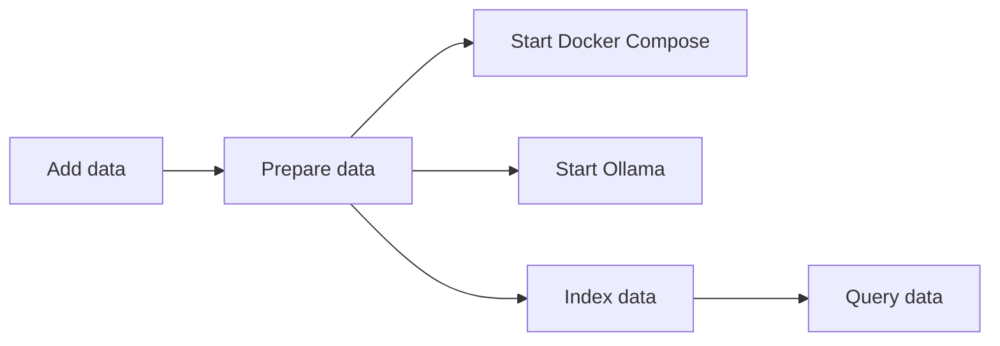
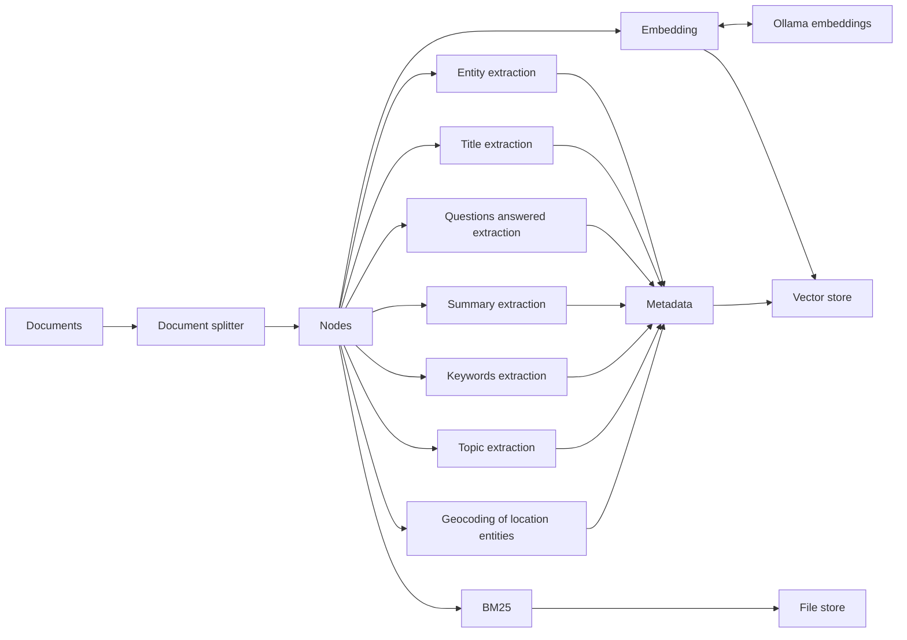
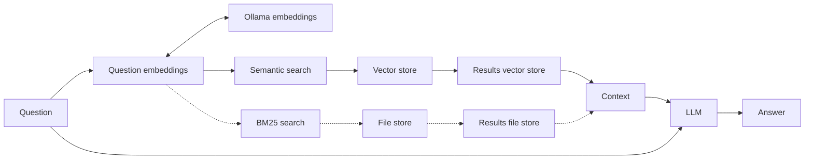

# iREAL - Backend

This backend is a RAG system to answer questions about a set of historical records about NSW schools that served Indigenous Australian communities.

The RAG is built using [LLamaIndex](https://www.llamaindex.ai),
[Ollama](https://ollama.com) to run a local LLM, and the
[Qdrant](https://qdrant.tech/) vector store.

## Getting started

### Dependencies

- [Docker](https://www.docker.com), [Docker Compose](https://docs.docker.com/compose/)
- [Ollama](https://ollama.com)
- [Pandoc](https://pandoc.org) and a flavour of [TeX](https://www.tug.org/), to
  convert the school records from `doc` to `markdown`
- [Poetry](https://python-poetry.org/)

### Setup

1. Clone the repository
1. Set up the environment with `poetry`

    ```sh
    poetry install
    poetry shell
    ```

1. Add the initial data in `data/0_raw/records`
   - [Aboriginal School Files](<https://emckclac.sharepoint.com/:f:/r/sites/AHkdl/Shared%20Documents/iREAL%20(AI%20and%20Indigenous%20Heritage)/EXTERNAL/Materials%20from%20partners/Datasets/Aboriginal%20School%20Files%20-%20%5Bnot%20to%20be%20shared%5D?csf=1&web=1&e=GK55QJ>)
1. Prepare the data

    ```sh
    poetry run prepare
    ```

1. Start the Docker stack with

    ```sh
    docker compose up --build
    ```

1. Start Ollama

    ```sh
    ollama start
    ```

1. Configure the project parameters. Rename `.env.example` to `.env` and adjust the values as needed
1. Run the cli tool to create an index, chat or export data from the index. Use the `-h` flag to see the available options

    ```sh
    poetry run cli -h
    ```

## System architecture

### Overview



### Indexing



#### Metadata extraction

Several types of metadata are being [extracted](https://docs.llamaindex.ai/en/stable/module_guides/indexing/metadata_extraction/) to enrich the index. Below are more
details about each extraction.

##### Entity extraction

Entities are extracted using the [default configuration](https://docs.llamaindex.ai/en/stable/examples/metadata_extraction/EntityExtractionClimate). The default
model extracts multiple entity types; of relevance for the project are: persons, organisations, locations, diseases, times.

##### Geocoding of location entities

After the entities are extracted, a [transformer](app/engine/transformers.py#L101)
is used to parse the `location` entities and match them against a
[CSV](https://emckclac.sharepoint.com/:x:/r/sites/AHkdl/Shared%20Documents/iREAL%20(AI%20and%20Indigenous%20Heritage)/EXTERNAL/Materials%20from%20partners/Datasets/nsw-missions.csv?d=wa0652550c5fc44fe98e02b339b7c1fac&csf=1&web=1&e=ieXe8h)
file that contains coordinates for places in NSW. If there is a match between the extracted locations and the data in the CSV, a new metadata element is created, `geo` that contains the location name and the coordinates.

##### Keyword extraction

Extracts the top 5 keywords for each chunk of text, using the LLM and a
[custom prompt](cli.py#L155) to exclude entity names from the keywords.

##### Questions answered extraction

Generates questions that can be answered by the chunk of text being indexed.

##### Summary extraction

Summaries are extracted for the current chunk being indexed and also for
previous and next chunks in the same document.

#### Title extraction

Extracts potential titles for the chunks of text being indexed.

##### Topic extraction

Topic extraction is based on the entity extraction process, but it uses the LLM
with a [custom prompt](app/engine/transformers.py#L17) to extract topics from the text chunks.

### Querying



## Sample queries

Sample queries can be found in [Sharepoint](<https://emckclac.sharepoint.com/:w:/r/sites/AHkdl/Shared%20Documents/iREAL%20(AI%20and%20Indigenous%20Heritage)/EXTERNAL/Materials%20from%20partners/AWB%20Dataset%20Queries.docx?d=weac8d67e057a44aeb64645f2fed08265&csf=1&web=1&e=94Xj8O>).

### Examples, 2024-08-05

- **Researcher: Who were the teachers at Nanima Aboriginal School?**

  **(B)ase, [R\]etriever, Retr(y), (H)yDe:**

  > RAG 4.284:  Among the known teachers at the Nanima Aboriginal School are Miss. Rose Taylor and Mrs. E. M Higgins. Mrs. Higgins had previously taught at this school before moving on to teach at Walmer Public School, and Miss. Taylor was in the position of Teacher at the time when a replacement was being considered.
- **What were the health conditions at Aboriginal schools?**

  **(B)ase, [R\]etriever, Retr(y), (H)yDe:**

  >RAG 0.521:  The provided context does not directly mention the health conditions at all Aboriginal schools in New South Wales. However, it does offer some insights into the living conditions of students at specific schools, which can indirectly suggest something about their overall health.
  >
  >For instance, at Runnymede Aboriginal School, the number of children on the station was significant (about 20), and the Chief Inspector noted that some of them lived in the bush and would attend if a school were opened. However, there is no mention of specific health concerns related to these children.
  >
  >At Pelican Island Aboriginal School, there were reports of dissatisfaction among the Aborigines regarding punishment, which might have affected their attendance at school. Additionally, an outbreak somewhat resembling Chicken Pox was reported at Noocoorilma Aboriginal School, causing the temporary closure of the school and treatment of all children with medicine and ointment.
  >
  >While these examples suggest that health issues may have been present in some Aboriginal schools, more comprehensive research would be required to fully understand the overall health conditions at Aboriginal schools during this time period.
- **Researcher: Were any Aboriginal reserves close to state run institutions for Stolen Generations survivors?**

  **(B)ase, [R\]etriever, Retr(y), (H)yDe:**

  >RAG 4.767:  Yes, in the provided context, there are references to Aboriginal reserves being located near state-run institutions. The Summer Vale Aboriginal School is situated on an Aboriginal reserve (mentioned multiple times), and it seems that Kinchela Aboriginal School also operates near an Aboriginal reserve or station, as stated in the excerpt from the Kinchela Aboriginal file.
- **Researcher: who were the teachers at Brungle?**
  
  **(B)ase, [R]etriever, Retr(y), (H)yDe:**

  >RAG 3.933:  The teachers mentioned in the provided context are Mr Samuel Bennett (initially), Mr Ussher, and Miss Daisy V Hubbard.

## Resources

### Tutorials

- [RAG with llamaIndex and Elasticsearch](https://www.elastic.co/search-labs/blog/rag-with-llamaIndex-and-elasticsearch)
- [RAG using LLama 3.1 by Meta AI](https://lightning.ai/lightning-ai/studios/rag-using-llama-3-1-by-meta-ai)
- [How to run Ollama locally on GPU with Docker](https://medium.com/@srpillai/how-to-run-ollama-locally-on-gpu-with-docker-a1ebabe451e0)

### Chunking

- [Chunking for RAG: Best Practices](https://unstructured.io/blog/chunking-for-rag-best-practices)
- [Understanding Embeddings in RAG and How to use them - Llama-Index](https://www.youtube.com/watch?v=v6g8eo86T8A)
- [How to Set the Chunk Size in Document Splitter | RAG | LangChain](https://www.youtube.com/watch?v=1bbDH3kyf9I)

### Models

- [Mistral](https://ollama.com/libray/mistral)
- [Llama 3](https://ollama.com/library/llama3)
- [SpanMarker for Multilingual Named Entity Recognition](https://huggingface.co/tomaarsen/span-marker-mbert-base-multinerd)
- [NuExtract](https://huggingface.co/numind/NuExtract)

### Observability

- [Langfuse](https://langfuse.com)
- [LlamaIndex Langfuse Callback Handler](https://docs.llamaindex.ai/en/stable/examples/observability/LangfuseCallbackHandler/)

## Notes

- Using `IngestionPipeline` to ingest the documents into the vector store is
  faster than using the `VectorStoreIndex` class
- [Multi-step queries](https://docs.llamaindex.ai/en/stable/understanding/putting_it_all_together/q_and_a/#multi-step-queries)
  can help break down complex queries into an initial subquestion, and
  sequential subqueries until a final answer is returned. This is more expensive
  to run.
- Had issues with `elasticsearch` both with the index creation and querying. The
  indexing was quite a lot slower and the querying always returned a score
  of `1` even when the query was not a match.
- _Semantic drift_/_retrieval degradation_ seems to happen with this dataset as the number of documents indexed increased. This could be due to the fact that the
  document chunks are not suitable for indexing, or that they might be too similar to each other.
  - The [`RetryQueryEngine`](https://docs.llamaindex.ai/en/stable/examples/evaluation/RetryQuery/#retry-query-engine) is used to retry the query if the response is not satisfactory.
  - Using hybrid search, the vector store and [`BM25 retriever`](https://docs.llamaindex.ai/en/stable/examples/retrievers/bm25_retriever/) mitigates
  some of the issues with _semantic drift_, particularly when the queries mention
  specific entity names.
